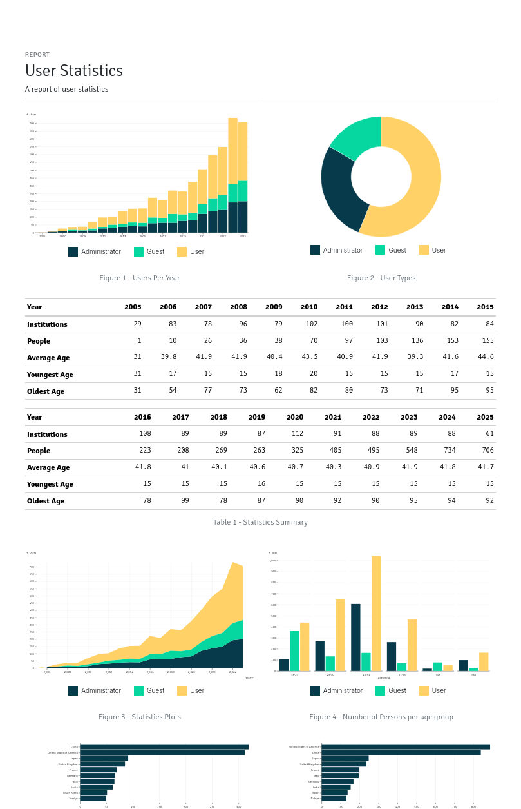

.. Django ReportCraft documentation master file, created by
   sphinx-quickstart on Tue Mar 18 15:06:55 2025.
   You can adapt this file completely to your liking, but it should at least
   contain the root `toctree` directive.

Django ReportCraft
==================

Welcome to the Django ReportCraft documentation. This application allows you to dynamically design and generate reports in Django.

.. toctree::
   :maxdepth: 2
   :caption: Contents:

   installation
   configuration
   usage
   api
   contributing