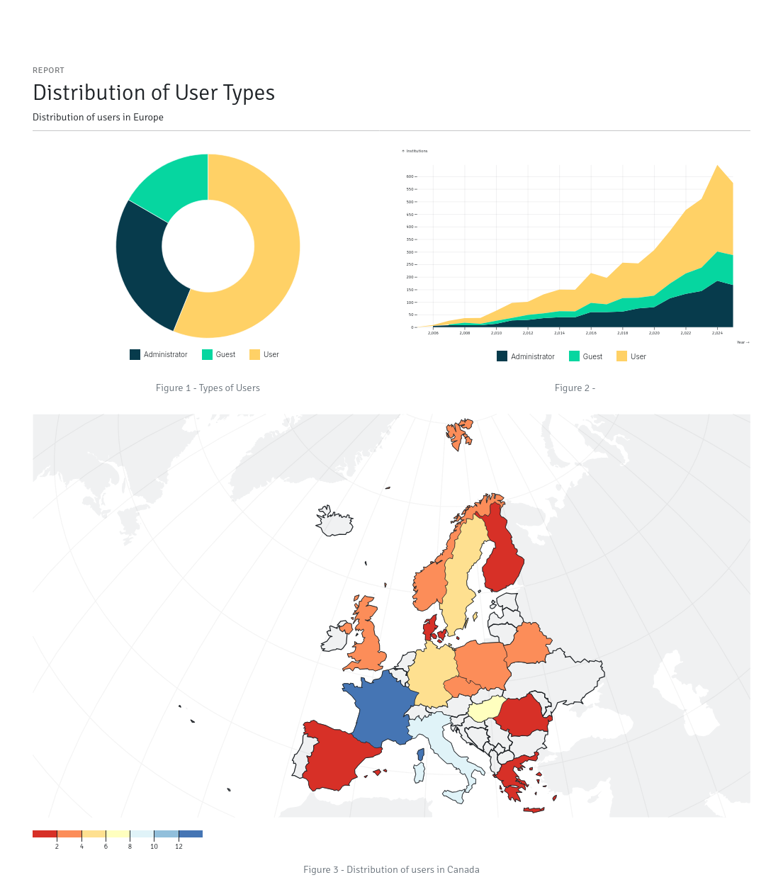

.. Django ReportCraft documentation master file, created by
   sphinx-quickstart on Tue Mar 18 15:06:55 2025.
   You can adapt this file completely to your liking, but it should at least
   contain the root `toctree` directive.

Django ReportCraft
==================

Welcome to the Django ReportCraft documentation. This application allows you to dynamically design and generate reports
in Django.

The source code can be found on Github at
`https://github.com/michel4j/django-reportcraft <https://github.com/michel4j/django-reportcraft>`_.

Earlier versions were based on `C3js <https://c3js.org/samples/chart_area.html>`_. The current version uses
the `Observable Plot Javascript library <https://observablehq.com/plot/>`_ exclusively for almost all charts,
except for Pie and Donut charts which are written using plain `D3js <https://d3js.org/>`_.

GeoCharting makes use of map data from `Natural Earth <https://www.naturalearthdata.com/about/>`_.

Example reports generated by Django ReportCraft are shown below:

.. image:: static/report-example.png
  :width: 100%
  :alt: Example Report

.. toctree::
   :maxdepth: 2
   :caption: Contents:

   installation
   configuration
   usage
   api
   contributing