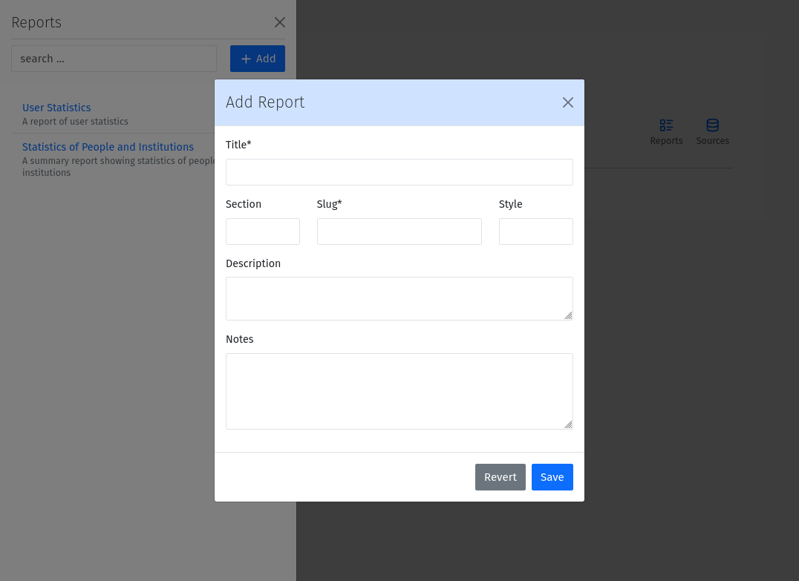
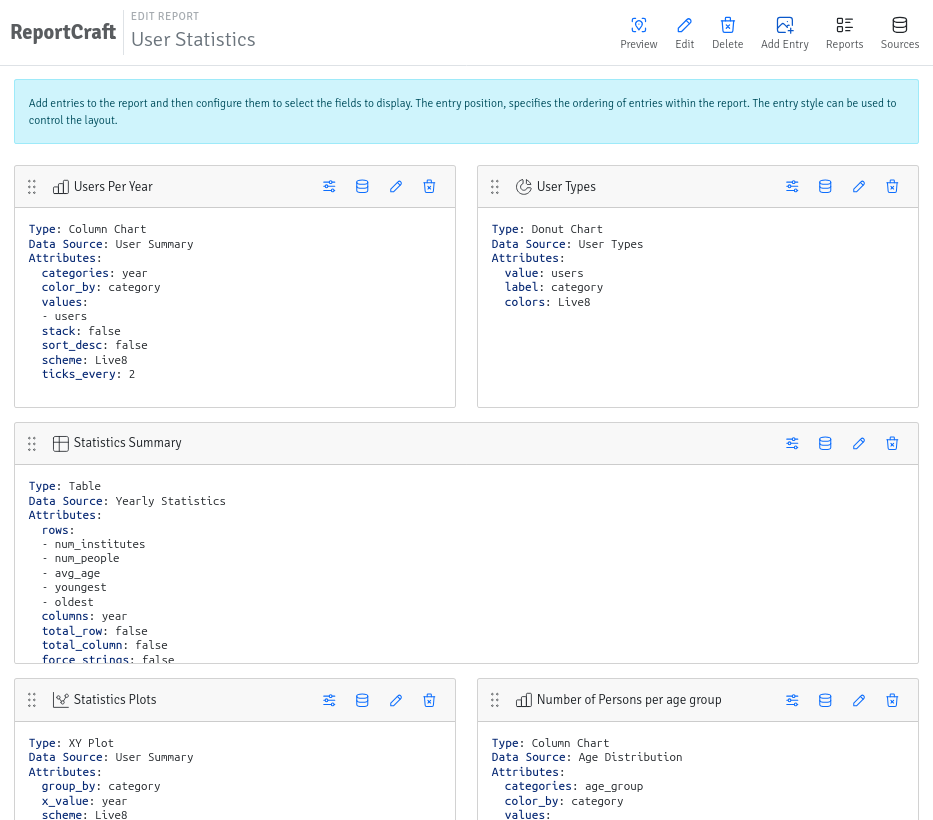
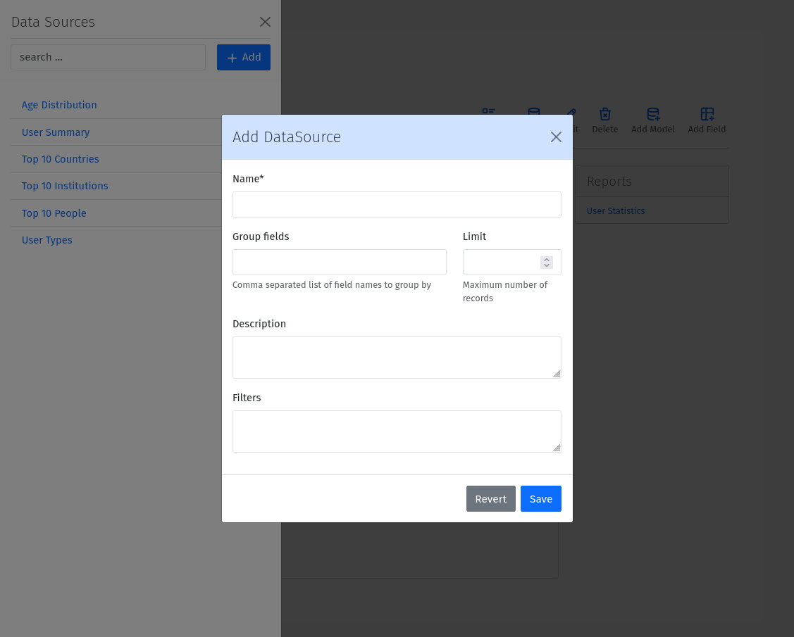
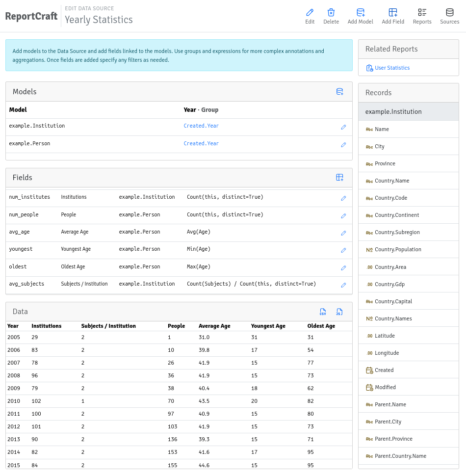
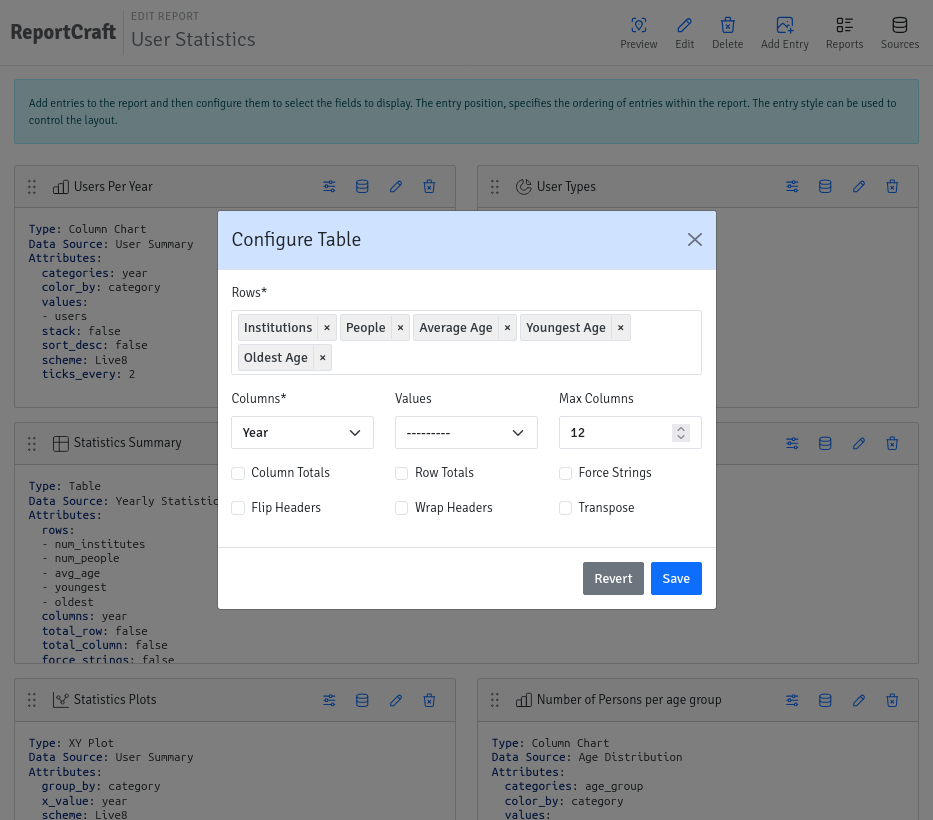
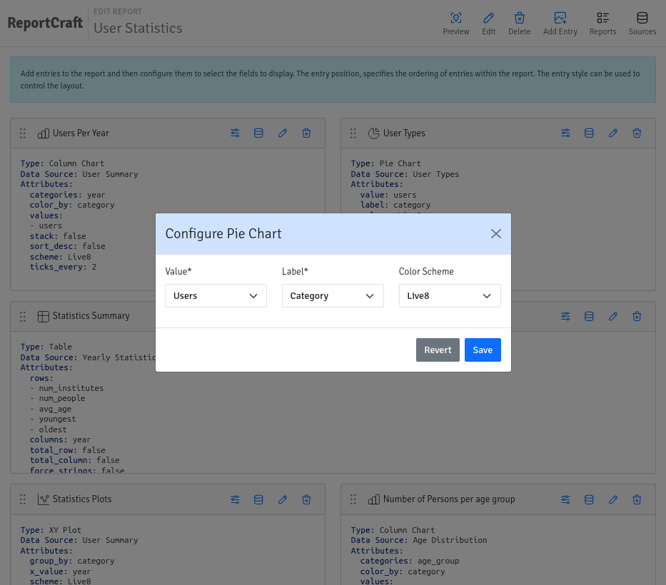

Usage
=====

To use Django ReportCraft, Navigate to https://mysite/reports/editor/ and create a new report entry by clicking the
:guilabel:`+ Add` button from the Reports list.

- Title: The title of the report. This should be a human readable string.
- Description: A description of the report. Use this to provide additional information about the purpose of the report.
- Section: A slug to use for grouping reports. This could be any valid slug
- Style: a css class to apply to the report. This can be used to apply custom styles to the report.
- Notes: Notes to display with the report. Notes are often used to provide additional information about the report.

Once you have created a report, you can build the report using the graphical designer by creating Data Sources,
Data Fields, and Report Entries.

Data Sources
------------

A Data Source is a model that provides data for the report. You can create a new Data Source by clicking the
:guilabel:` + Add` button from the Data Sources list. To create a new Data Source, you need to provide the following
information:

- Name: The name of the Data Source.
- Group Fields: A comma separate list of group fields to use for aggregating the data.
- Limit: The maximum number of records to return. This field is optional.
- Description: A description of the Data Source. Use this to provide additional information about the purpose of the
  Data Source.
- Filters: Filters to use for selecting a subset of the data. Filters are used to limit the data returned by the Data Source.
  The filters should be a valid :ref:`Filters <filters>`. See the Filters section below.

As you build the data source, you can preview a snippet of the data in the Data card at the bottom of the page, and
even use the download button to download a JSON representation of the full data set.

Data Source Models
------------------
After creating a Data Source, you can add Models to it. Models need to be added first, as all Data Fields are linked
to specific models defined within the Source. Models can be added by clicking the Add Model button from the Data Source
editor pages.  To add a new Model, you need to provide the following information:

- Model: The model to use for the data source. Select a model from the dropdown list. Only models that are part of
  applications whose `app_label` is included in the REPORTCRAFT_APPS setting list will be available.
- Group Expressions: For each group field, you can provide an expression to use for grouping the data. The expression
  should be a valid :ref:`Expression <expressions>`. See the Expressions section below.

Data Fields
-----------
After adding a Model, you can add Fields to it. Fields can be added by clicking the Add Field from the Source Editor
page.  The following information is required to add a new Field:

- Name: The name of the field. This should be a valid identifier. We recommend using snake_case for the field name. When
  the field name matches a field already present in the model, the data will be fetched from the model field and the
  expression will be ignored.
- Label: The label to use for the field in the report. This should be a human readable string.
- Model: The model to use for the field. Select a model from the dropdown list. Only models that have been added to the
  Source, are available.
- Ordering (optional): A signed integer to use for ordering by the values of the field. Larger magnitutes get precedence,
  and the sign determined the order (ascending or descending).
- Default (optional): The default value to use for the field if no entries are found.
- Precision (optional): The number of decimal places to use for the field. Values are rounded to the specified precision.
- Position: The position of the field relative to other fields in the report. While the `Ordering` field is used for
  ordering the data, the `Position` field is used for ordering the fields in the report.
- Expression: The expression to use for the field. The expression should be a valid `Expression`. See the Expressions
  section below. The expression is required for fields that do not already exist in the model.

.. _expressions:

Expressions
-----------
Expressions are used to define how to calculate the value of a field. Expressions can be simple field references or
Mathematical expressions. The following operators are supported:

- `+`: Addition
- `-`: Subtraction
- `*`: Multiplication
- `/`: Division
- `-`: Unary negation

Django field names are referenced using CamelCase. For example, to reference a field named `total_amount`, you would use `TotalAmount`
in the expression. Related fields lookups must be referenced using the `.` operator instead
of the `__` operator. For example, to reference a related field named `name` on a related model named `institution`, you would
use `Institution.Name` in the expression instead of the low-level `name__institution` identifier.

Any unquoted identifier that is not a function or a literal is assumed to be a field name.  For example, `TotalAmount * 0.1`
would multiply the value of the `TotalAmount` field by the value 0.1.  You can also use parentheses to group expressions. For example,
`(TotalAmount + TaxAmount) * 0.1` would add the value of the `TotalAmount` field to the value of the `TaxAmount` field and
then multiply the result by 0.1.  String literals must be enclosed in single or double quotes. For example, `'Hello, World!'`.

Functions must use parentheses immediately after the identifier to enclose arguments. Nesting and keyword arguments are
supported.

The special `this` identifier can be used to reference the current model. For example, the expression `Count(this)`
on a field defined for the `example.Person` model, would count the entries in the `example.Person` model. This can
be especially useful when using the `Count` function with the `distinct` keyword, like `Count(this, distinct=True)`.

The following Django database functions are supported. Please consult the Django documentation on Database Functions
for more information:

.. code-block:: python

    [
        Sum, Avg, Count, Max, Min, Concat, Greatest, Least,
        Abs, Ceil, Floor, Exp, Ln, Log, Power, Sqrt,
        Sin, Cos, Tan, ASin, ACos, ATan, ATan2, Mod, Sign, Trunc,
        ExtractYear, ExtractMonth, ExtractDay, ExtractHour, ExtractMinute,
        ExtractSecond, ExtractWeekDay, ExtractWeek,
        Upper, Lower, Length, Substr, LPad, RPad, Trim, LTrim, RTrim,
        Radians, Degrees, Q,
        ShiftStart, ShiftEnd, Hours, Minutes
    ]

Additionally, the following custom functions functions are supported:

- `ShiftStart`: Round down the time of a DateTime field to the nearest hour. An extra `size` keyword argument
  can be used to specify the shift size, by default 8 Hrs (00:00, 08:00, 16:00).
- `ShiftEnd`: Round up the time of a DateTime field to the nearest 8 Hrs (08:00, 16:00, 00:00). Also takes the optional
  `size` keyword argument.
- `Hours`: Calculate the total hours from a Duration. A duration is a difference between two DateTime fields.
- `Minutes`: Calculate the total minutes from a Duration.

For date based fields, you can use subfields to extract parts of the date. For example, instead of using a function to
extract the year from a date field like `ExtractYear(Date)` in the expression. It is valid and much easier to use
`Date.Year`.

Here are some xamples of valid expressions:

.. code-block:: python

    TotalAmount * 0.1
    (TotalAmount + TaxAmount) * 0.1
    TotalAmount + TaxAmount
    'Hello, World!'
    Concat(FirstName, " ", LastName)
    Sum(TotalAmount)
    Sum(TotalAmount) / Count()
    Sum(Metrics.Citations) + Avg(Metrics.Mentions)
    Sum(Metrics.Citations - Metrics.Mentions)
    Avg(Metrics.Citations + Metrics.Mentions)
    Published.Year
    -Count(this)
    Count(Journal, distinct=True)",
    Concat(Journal.Title, ' (', Journal.Issn, ')')
    Avg(Journal.Metrics.ImpactFactor)
    Avg(Metrics.Citations) / Avg(Metrics.Mentions)

.. _filters:
Filters
-------
Filters are used to limit the data returned by a Data Source. Filters must only use fields added to the Data Source.
Native low-level model fields are not supported. Filters are boolean expressions defined using the following extended
Python-like syntax:

.. code-block:: python

    [
        'field_name operator value',
        '(field_name operator value) and (field_name operator value)',
        '(field_name operator value) or (field_name operator value)',
        '(field_name !operator value)',
        '( field_name operator value ) and ( field_name operator value )'
    ]

Field names are case-insensitive and must match the names of the fields added to the Data Source. values can be
strings, numbers, or boolean values. Boolean values are case-insensitive, such that `TRUE, True, true` are all valid.
Strings must be enclosed in single or double quotes.

Parentheses are always required around the basic `field_name operator value` expressions when combined.
Several levels of nesting are supported, and the expressions can be combined using the `and` and `or` operators.

The following operators are supported:

- `=` or `==`: Equal to
- `!=`: Not equal to
- `<`: Less than
- `<=`: Less than or equal to
- `>`: Greater than
- `>=`: Greater than or equal to
- `has`: contains a value
- `^=`: String starts with
- `$=`: String ends with
- `^~`: Case-insensitive string starts with
- `$~`: Case-insensitive string ends with
- `~=`: Case-insensitive string equals
- `~has`: Case-insensitive string contains a value
- `regex`: Value matches a regular expression
- 'isnull`: Value is null (or empty)

Unlike Python, the `!` operator modifier can be prefixed to any of the above operators (except for `!=`) to negate it.
For example, the following expressions are valid:

.. code-block:: python

    'total_amount > 100'
    'journal != "Nature"'
    'journal isnull True'
    'total_amount !> 100'
    '(total_amount > 100) and (journal != "Nature")'
    '(total_amount !<= 100) and (Journal != "Nature")'

Report Entries
--------------

A report is made up of a collection of entries. Each entry is a single component that can be displayed in a report. You
can create a new entry by clicking the Add Entry button from the Report Editor page. To create a new entry, you need to
provide initially the following information:

- Title (optional): The title of the entry. This will be displayed as either the heading of the entry or the caption of the table or
  chart.
- Position: The position of the entry relative to other entries in the report. The position is used to order the entries
  in the report.
- Description (optional): A description of the entry. This will be displayed as a paragraph of text at the top of the entry.
- Notes (optional): Notes to display at the bottom of the entry. Notes are often used to provide additional information
  about the entry.
- Data Source: The data source to use for the entry. Select a data source from the dropdown list. Only data sources that
  have been added to the report are available.
- Width: The width of the entry. The width is used to determine how much space the entry takes up in the report. The width
  is a fraction of the total width of the report.  The following widths are supported:

    - Full: The entry takes up the full width of the report.
    - Three Quarters: The entry takes up three quarters of the width of the report.
    - Two Thirds: The entry takes up two thirds of the width of the report.
    - Half: The entry takes up half of the width of the report.
    - Third: The entry takes up a third of the width of the report.
    - Quarter: The entry takes up a quarter of the width of the report.

- Type: The type of the entry. The type determines how the data is displayed. The following types are supported:

    - Table: A table that displays the data in a tabular format.
    - Bar Chart: A chart that displays the data in a bar chart format.
    - Pie Chart: A chart that displays the data in a pie chart format.
    - XY Plot: A chart that displays the data in a XY chart format with lines or points.
    - Chart: A chart that displays the data in a graphical format.
    - Histogram: A chart that displays the data in a histogram format.
    - Text: A text entry that displays the data as a paragraph of text.
    - List: A special type of table that displays a list of entries. Each row in a List is usually quite similar to the other rows unlike a Table.
    - Rich Text: A text entry that displays markdown formatted text.

Once you have created an entry, you can configure it using the toolbar icons on the entry.  The specific configuration
options depend on the type of the entry.

Table Entry
-----------
A Table Entry displays the data in a tabular format. The table entry has the following configuration options:

- Rows: One or more fields to display as the rows of the table. Select the fields to display as the rows from the dropdown list.
  Only fields that have been added to the data source are available.
- Columns:  The field to use as the columns of the table. For example, if the data is grouped by Year, the `Year`
  field would be an appropriate Column field.
- Values: The fields to use as the values of the table when a single field is specified under Rows. In this case, the
  Values of the Rows field will be used as the columns and the table cells will contain corresponding values from the
  Values field.
- Column Totals: Toggle to add a row at the bottom of the table that contains the totals for each column.
- Row Totals: Toggle to add a column at the right of the table that contains the totals for each row.
- Transpose:  Flip the rows and columns of the table. This is useful when the data is more naturally displayed with the
  rows as columns and the columns as rows.
- Force Strings: Convert all values to formatted strings.

Bar Chart Entry
---------------
A Bar Chart Entry displays the data in a bar chart format. The bar chart entry has the following configuration options:

- X Axis: The field to use as the x-axis of the chart. This field will be used to label the bars on the x-axis.
- Y Axis: One or more fields to use as the y-axis of the chart. This field will be used to determine the height of the bars on the
  y-axis. Enter multiple fields to represent multiple series of bars.
- Values: The field to use as the values of the chart. This field will be used to determine the height of the bars on the
  y-axis if a single field is specified under Y Axis. In this case, the
  Values of the Y-axis field will be used as the series.
- Sort By: The field to use for sorting the bars on the x-axis.
- Color By: The field to use for coloring the bars.
- Aspect Ratio: The ratio of the width to the height of the bars.
- Culling: The maximum number of X-axis ticks to display.
- Stack: Specify the groups of fields to stack. Only fields already specified under Y-axis should be included
- Wrap Labels: Wrap the labels on the x-axis to multiple lines.
- Vertical bars: Display the bars vertically instead of horizontally.
- Sort Descending: Sort the bars in descending order.
- Color Scheme: The color palette to use for coloring the bars. The following color schemes are supported:

Pie Chart Entry
---------------

A Pie Chart Entry displays the data in a pie chart format. The pie chart entry has the following configuration options:

- Value: The field to use as the values of the chart. This field will be used to determine the size of the slices in the
  pie chart.
- Label: The field to use as the labels of the chart. This field will be used to label the slices in the pie chart.
- Color By: The field to use for coloring the slices.

XY Plot
-------
An XY Plot Entry displays the data in a XY chart format with lines or points. The XY plot entry has the following
configuration options:

- X Axis: The field to use as the x-axis of the chart. This field will be used to label the points on the x-axis.
- Y1 Label: The label to use for the y-axis on the left side of the chart.
- Y1 Axis: One or more fields to use as the source of Y1 axis values of the chart. Each field will be a separate series
  on the chart.
- Y2 Label: The label to use for the y-axis on the right side of the chart.
- Y2 Axis: One or more fields to use as the source of Y2 axis values of the chart. Each field will be a separate series
  on the chart.
- Scatter Plot: Toggle this option to display the data as a scatter plot instead of a line plot.
- Color Scheme: The color palette to use for coloring the lines or points. Each series will be assigned a color based on
  the color scheme.

List Entry
----------
A List Entry displays a list of entries with one or more columns of data, where. Each row in a List is usually quite
similar to the other rows unlike a Table Entry. The List Entry has the following configuration options:

- Columns: The fields to display as columns in the list. Select the fields to display as columns from the dropdown list.
  Only fields that have been added to the data source are available. You can add multiple columns to the list. The order
  of the columns in the list is determined by the `Position` of the corresponding field.
- Sort By: The field to use for sorting the rows in the list.
- Descending: Sort the rows in descending order.

Histogram Entry
---------------
A Histogram Entry displays the data in a histogram format. The histogram entry has the following configuration options:

- Values: The field to use as the source pf values for the histogram. This should be a numeric field and should return
  the raw data, not the histogram itself.
- Bins (optional): The number of bins to use for the histogram. If not specified, the number of bins will be determined
  automatically.
- Color Scheme: The color palette to use for coloring the bars in the histogram.

Rich Text Entry
---------------
A Rich Text Entry displays markdown formatted text. The rich text entry has the following configuration options:

- Text: The markdown formatted text to display in the entry.

Map / Geo Chart Entry
---------------------
A Map Entry displays the data in a map format using Google Charts. The map entry has the following configuration options:

- Resolution : The resolution of the map. The following resolutions are supported:
    - countries: A map of the world, with country boundaries displayed.
    - provinces: A map with provincial boundaries displayed.
    - metros: A map with city boundaries displayed.
- Location: The field to use as the location of the data. This field should contain the name of the location to display
  on the map. The location can be a country, state, city, or any other geographic location.
- Latitude: The field to use as the latitude of the data. This field should contain the lattitude of the location to
  display on the map.
- Longitude: The field to use as the longitude of the data. This field should contain the longitude of the location to
- Value: The field to use as the value of the data. This field should contain the value to display on the map. The value
  can be used to determine the size of the marker or the color of the marker.
- Color By: The field to use for coloring the markers. If provided, the markers will be colored based on the values of
  this field.
- Color Scheme: The color palette to use for coloring the markers.

Viewing Reports
===============
Once you have created a report, you can view it by clicking the Preview button from the Report Editor page to view
the report.

A list of all reports can be viewed by navigating to https://mysite/reports/view/ and selecting the report from the
list. Access to this page will be restricted according to the Mixins specified in the ReportCraft settings.
Alternatively, you can override the `reportcraft.views.ReportIndexView`, `reportcraft.views.ReportView` to generate
a new index with custom permissions.  Override the `get_limit_section` method to return a section name to only include
reports from that section in the index. In this case, also override `reportcraft.views.DataView` to customize access
to the data.

For example:

.. code-block:: python

    from reportcraft.views import ReportIndexView, DataView, ReportView

    class CustomReportIndex(ReportIndexView):
        link_url = 'custom-report-detail'

        def get_limit_section(self):
            return self.kwargs.get('section', 'default')

    class CustomReportData(DataView):
        ...

    class CustomReport(ReportView):
        data_url = 'custom-report-data'

        def get_queryset():
            """ custom queryset to check of the user has access to the report """
            ...

.. code-block:: python

    urlpatterns = [
        ...
        path('custom-reports/<slug:section>', CustomReportIndex.as_view(), name='custom-report-index'),
        path('custom-report/<slug:slug>/', CustomReport.as_view(), name='custom-report-detail'),
        path('custom-report-data/<slug:slug>/', CustomReportData.as_view(), name='custom-report-data'),
        ...
    ]